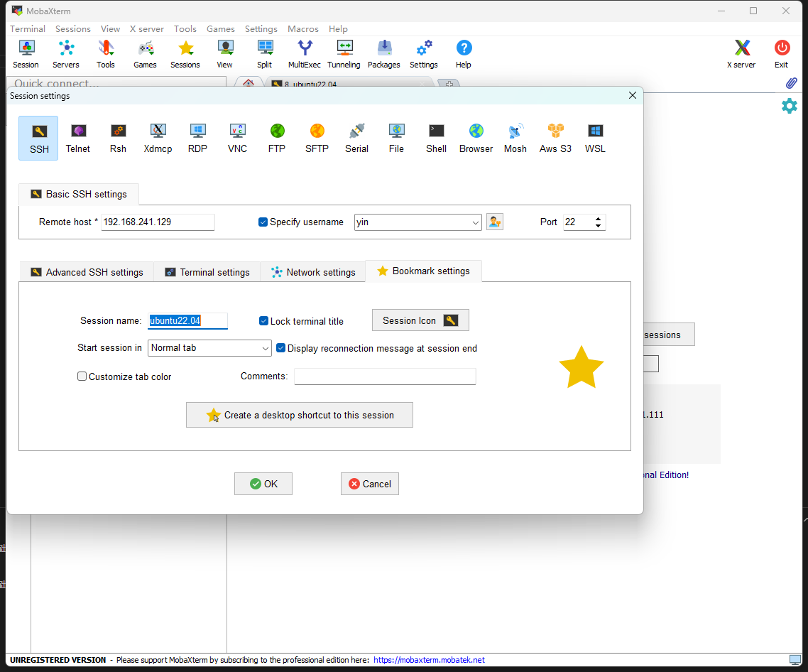
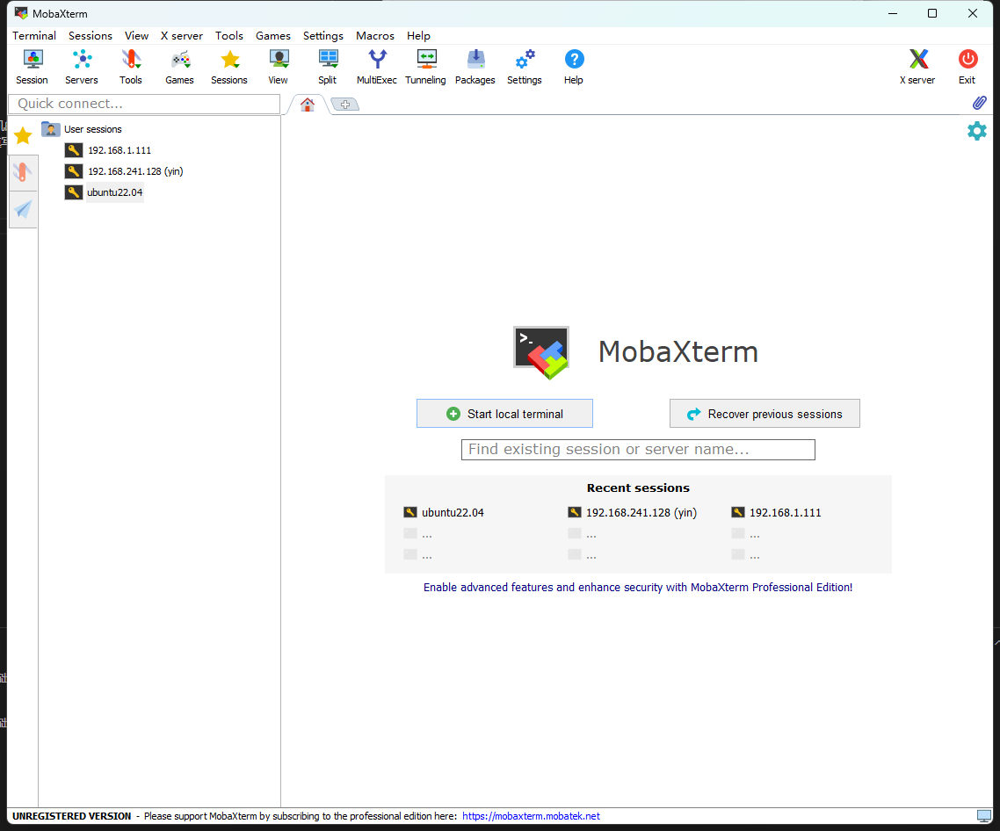
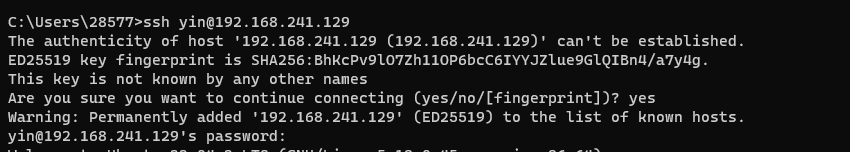

1、使用指令安装 ssh 服务 
` sudo apt install openssh-server -y `

2、如何 使用mobaxterm 连接

session --> ssh --> 填写 remote host (也就 虚拟机的ip) --> 勾选 specify username ，然后填写 登录用户名 --> bookmark settings ---> 填写 session name 也就是这个链接的别名 我这里是ubuntu22.04--->ok 保存

双击User sessions 中的 ubuntu22.04 就可以打开链接 ， 然后输入密码就可以登陆了

3、 如何使用cmd 窗口 链接
打开一个cmd窗口 ， 使用指令 ssh 用户名@IP地址 

我这边的例子为 `ssh yin@192.168.241.129`

第一次登陆输入yes 然后输入密码即可登陆，如下图

注意：在linux系统中，输入密码的时候是看不见自己输入的是什么字符，只管输入密码然后回车就行