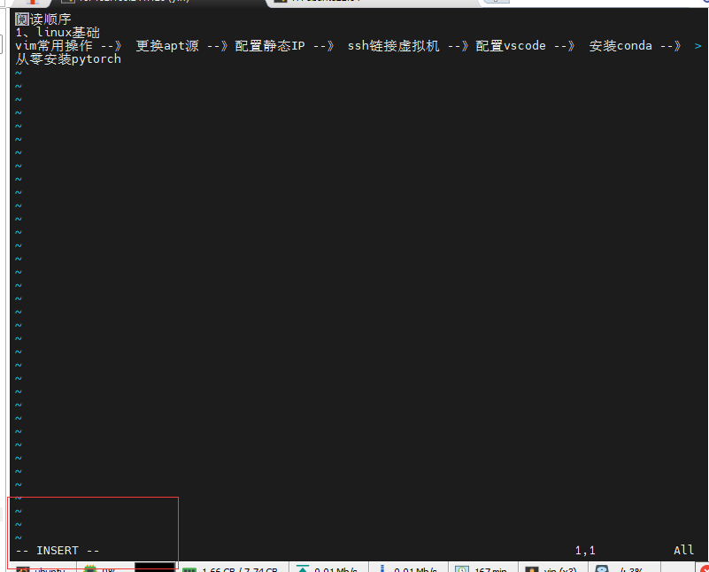
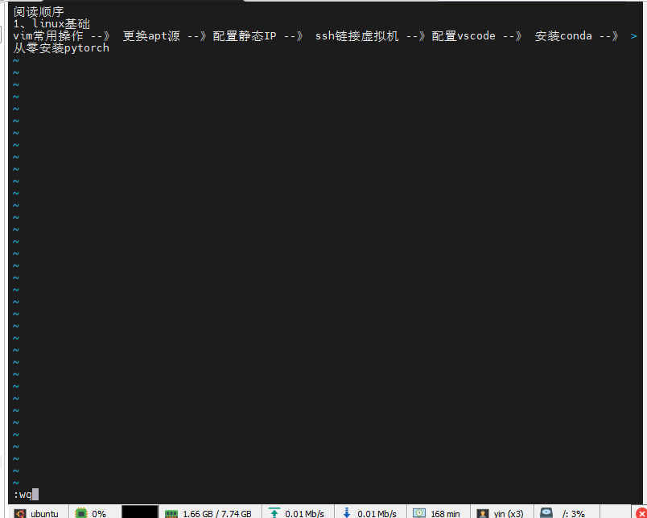
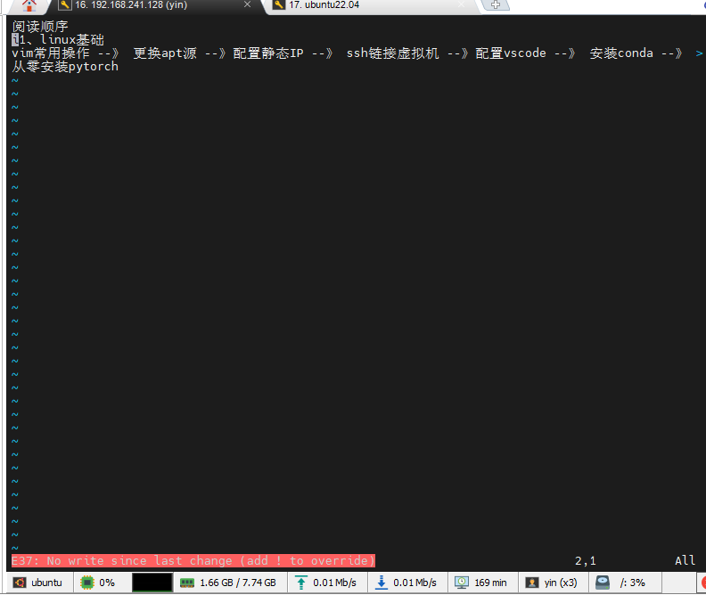
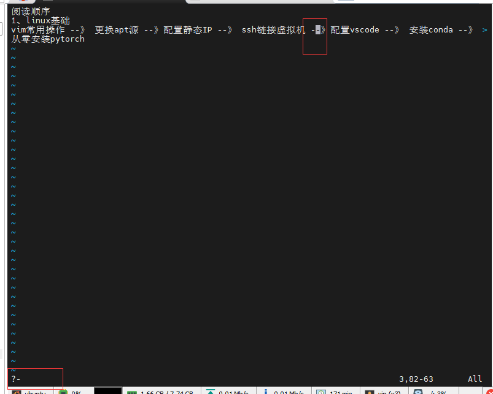

常用操作 

1、打开文件  vim 文件名
2、按 i 进行编辑模式

3、按Esc退出编辑模式

4、退出编辑模式后按 : 可以进行执行输入

例如 :wq 回车后是保存并退出

例如：q 是直接退出 ， 但是如果修改文件了则无法退出 ，如下图所示

提示你需要增加感叹号 ， 也就是 q！ 来强制退出

5、在退出编辑模式下，按 ？字符串 来搜索字符串 

通过 n 来查看下一处 ， N 来查看上一处

6、在退出编辑模式下， dd 来删除一行

其他更多操作可以在需要的时候百度