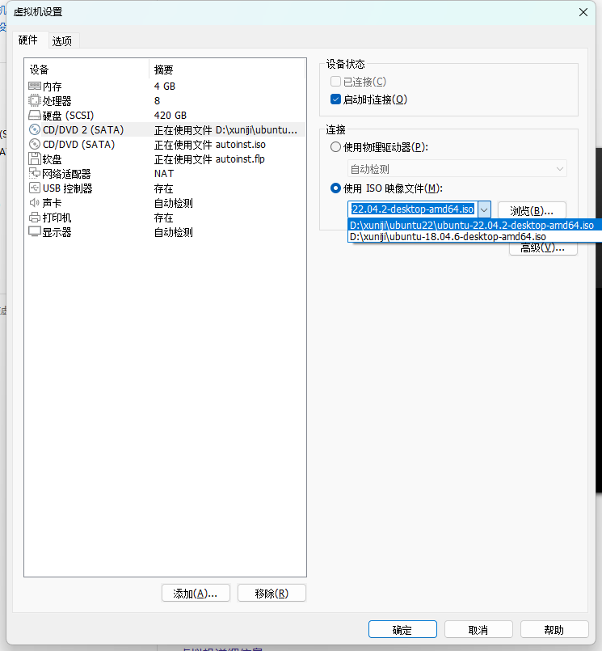
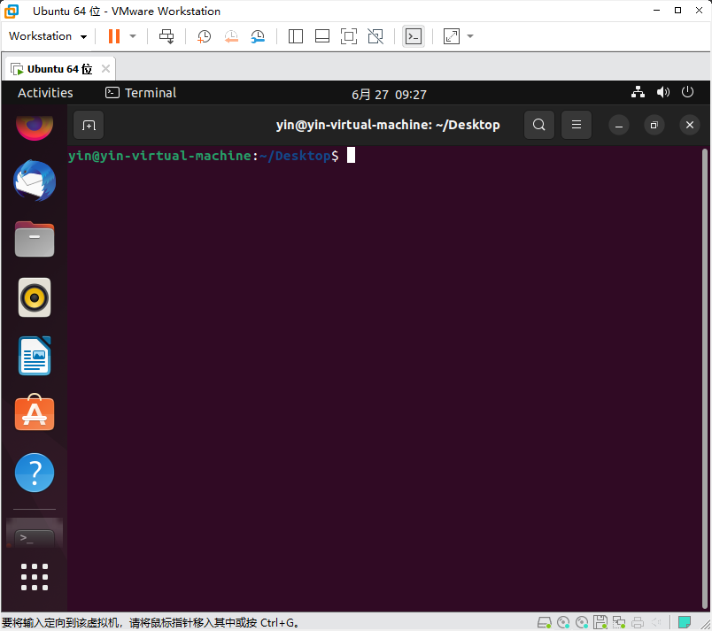
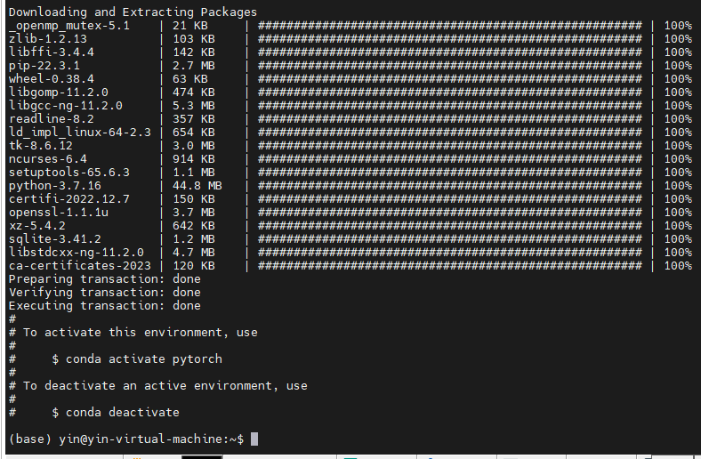
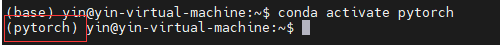
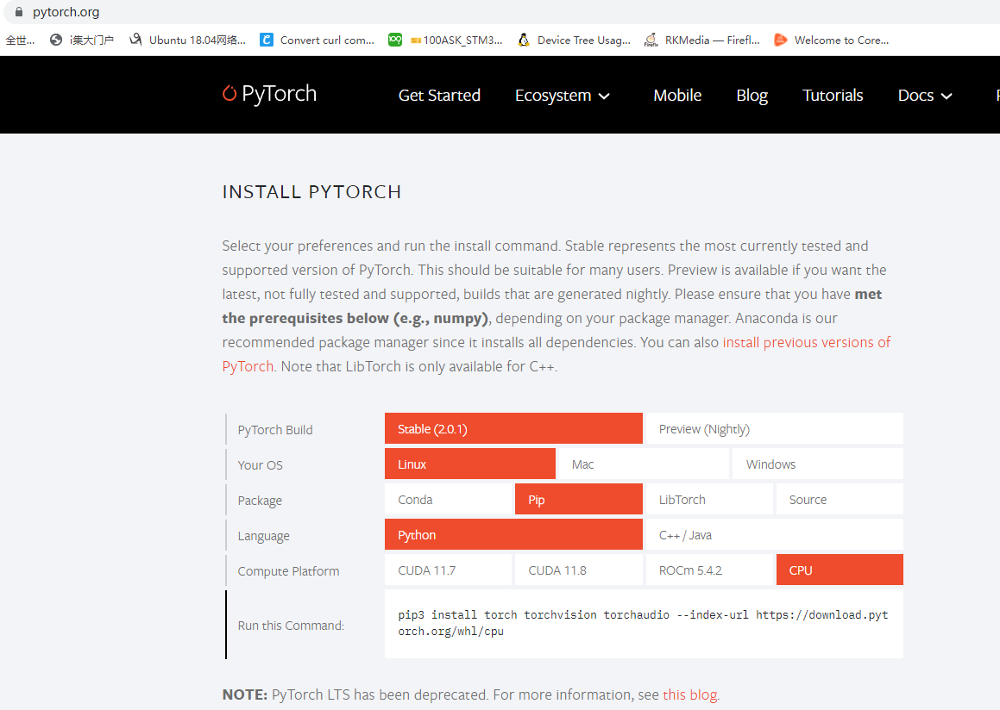
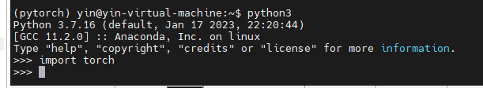

1、我的配置

其中内存和处理器根据自身电脑配置去选择 ， 硬盘最好弄大一点，因为它是动态扩容的，不会真的去占那么大空间，只有在你使用到的时候才会去占据空间，所以不用担心。然后使用的ubuntu版本为ubuntu-22.04-2-desktop-amd64.iso

2、打开terminal

3、查看我发的其他教程更新apt源 以及如何安装 conda

4、使用conda 新建一个conda 环境

` conda create -n pytorch python=3.7 `

这里我们创建了一个叫 pytorch 的环境 ， 它的python版本为3.7
安装完成后如下图

接着我们激活这个环境

使用指令 `conda activate pytorch`
效果如下图

4、前往pytorch官网 https://pytorch.org/

复制 Run this command 栏指令安装pytorch

安装完成后如下图

5、进入python查看是否安装成功
如下 使用指令:
` python3 `

` import torch `

如果没有报错就成功安装了pytorch

