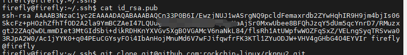
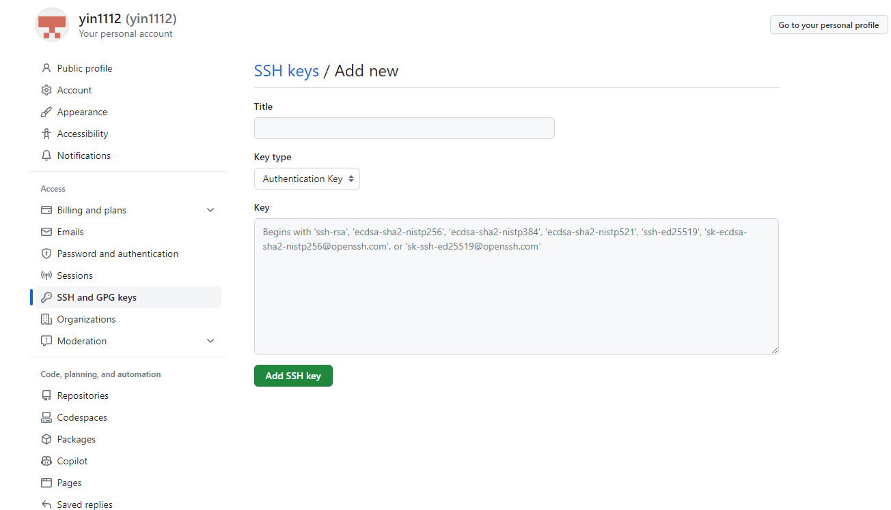
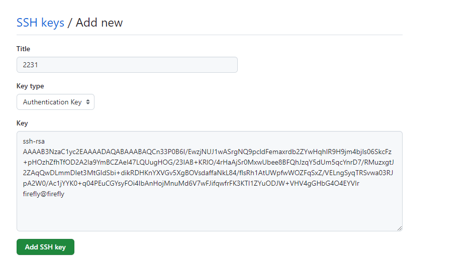
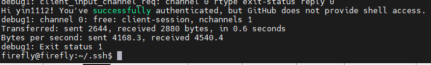

1、首先需要去github 上注册一个账户  ，然后在服务器上配置你的账户名和邮箱

sudo apt-get install git
git init
git config user.name "账户名"
git config user.email "邮箱"

2、在服务器上使用指令

`ssh-keygen && cd ~/.ssh `

如何一直回车回车，执行完成后，再执行指令

`cat id_rsa.pub `

会看到一串字符串

全部复制

3、打开github ， 登陆，点击头像 --》settings --》 ssh and gpg keys --》 new ssh key

4、到达如下界面 ， title 随便写 ， 把步骤2的字符串全部贴到key中，不要修改，然后点击 add ssh key ， 如下下图

5、使用指令 

` ssh -vT git@github.com `

测试联通性

最后出现如上图所示就算是成功配置了，就可以使用git clone 指令拉取项目