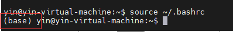

1、以ubuntu22.04 为例 ， 百度关键词
`ubuntu22.04  conda 安装` 
找到conda 的安装脚本 ， 我这里的安装脚本名字为 Anaconda3-2022.05-Linux-x86_64
下载链接如下 ： https://repo.anaconda.com/archive/Anaconda3-2022.05-Linux-x86_64.sh
2、使用wget 下载
` wget https://repo.anaconda.com/archive/Anaconda3-2022.05-Linux-x86_64.sh`
如果没有wget 指令，自行百度查询如何使用apt 安装

3、运行脚本

`bash Anaconda3-2022.05-Linux-x86_64.sh`

可以在输入 A的时候按两下 tab自动补全文件名

4、按照安装向导走完流程 ， 全程回车和输入 yes

5、安装完成后使用指令

` source ~/.bashrc `

如果成功安装在用户名前面会有个bash字样

