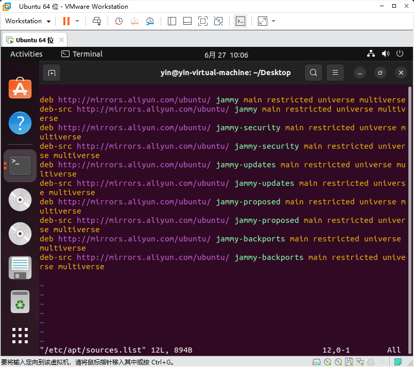

1、确认ubuntu版本，这里以ubuntu22.04为例
百度搜索 ` ubuntu22.04 apt 换源 ` 关键词，选择 阿里源 ， 我这个版本的源的例子如下：

deb http://mirrors.aliyun.com/ubuntu/ jammy main restricted universe multiverse
deb-src http://mirrors.aliyun.com/ubuntu/ jammy main restricted universe multiverse
deb http://mirrors.aliyun.com/ubuntu/ jammy-security main restricted universe multiverse
deb-src http://mirrors.aliyun.com/ubuntu/ jammy-security main restricted universe multiverse
deb http://mirrors.aliyun.com/ubuntu/ jammy-updates main restricted universe multiverse
deb-src http://mirrors.aliyun.com/ubuntu/ jammy-updates main restricted universe multiverse
deb http://mirrors.aliyun.com/ubuntu/ jammy-proposed main restricted universe multiverse
deb-src http://mirrors.aliyun.com/ubuntu/ jammy-proposed main restricted universe multiverse
deb http://mirrors.aliyun.com/ubuntu/ jammy-backports main restricted universe multiverse
deb-src http://mirrors.aliyun.com/ubuntu/ jammy-backports main restricted universe multiverse

2、打开apt 配置文件

` sudo vim /etc/apt/sources.list `

3、把步骤 1 的源覆盖到该配置文件中,如下图 ， 然后保存退出

4、更新配置

` sudo apt update `

`sudo apt upgrade `

5、结束
