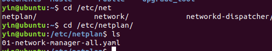
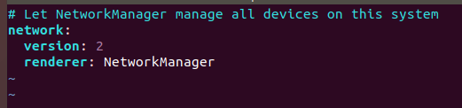
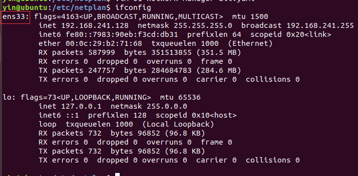
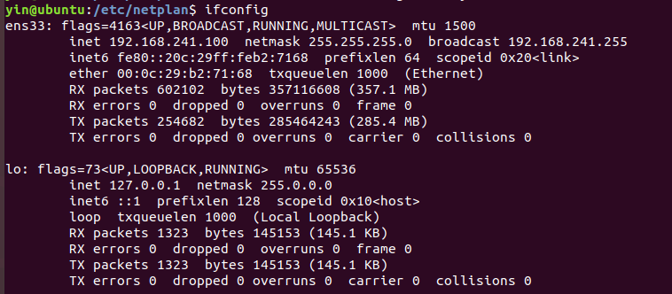
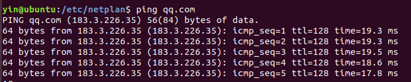
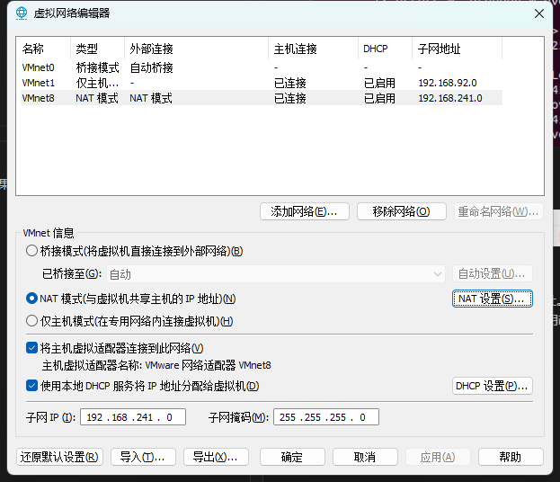
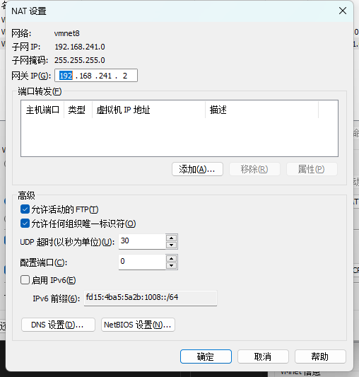

1、使用指令 cd /etc/netplan

2、ls 查看当前目录的文件

可以看到我们的目录下有一个 01-network-manager-all.yaml 的管理文件。
如果有多个文件，任意打开一个

3、使用指令 vim  或 vi 或 gedit 打开该文件 ，这里需要管理员权限，例如 `sudo vim 01-network-manage-all.yaml`
(可以使用 tab 键自动补全文件名字)

4、打开后如下
如果是空的也没事

5、现在可以对网卡进行配置，以我的虚拟机为例，网卡名称为ens33 （可以通过ifconfig 指令查看）

因此我们可以把ens33 网卡配置静态IP
如下图 , 注意格式，每个冒号后面都需要跟一个空格 

这里我们将dhcp4 功能关闭，不让网关随机分配ip，使用自己配置的ip地址 192.168.241.100/24，然后配置网关为192.168.241.2 ,dns 解析地址为 114.114.114.114 

这里的addresses、gateway4不能照抄 ， nameservers里面的addresses可以照抄 

这里填写的时候记得格式 ， 前面的空格需要Tab来缩减 ， 字段需要按照图中对齐

如何查看自己的子网IP和网关 ？ 请查看附录 1

6、 保存并退出

使用指令 `sudo netplan apply` ，应用配置

使用指令 `ifconfig` ，查询IP

可以看到inet 地址为我们配置的静态IP

7、验证网络是否通畅

使用指令 `ping qq.com` 查看 ， 可以看出网络ok

附录
1、
在vmware workstation pro 的顶部

打开 编辑 ---> 虚拟网络配置器  , 我的配置如下 ， 这里我们看子网地址，可以看出VMnet8是我们需要查看的虚拟网卡 。

因此选中Vmnet8 选项卡后 ，点击NAT设置 ，

可以看出我的NAT网络的网关为 192.168.241.2 ， 子网IP为192.168.241.0 ，所以我的ip前面192.168.241不能改，最后的0可以任意改成1-255之间的值，建议该成100-250之间的值

可能的问题1：
如果没有报错但是没有IP地址。可能是IP重复了，可以尝试修改IP ；如果修改后还是不行，就稍等一会，可能正在分配IP地址，大概5s后再使用ifconfig指令查询IP

可能的问题2：
出现没有 vim 指令的报错 

我们可以按照提示安装vim ， 例如 `sudo apt install vim`

可能的问题3：
如果发现ping 不同qq.com ， 可以试一下 ping 自己的网关，查看能不能ping通，如果不能，可能是配置问题，查看是否成功配置静态IP ，可以ping 通网关但是ping不通qq.com ，联系我。。
